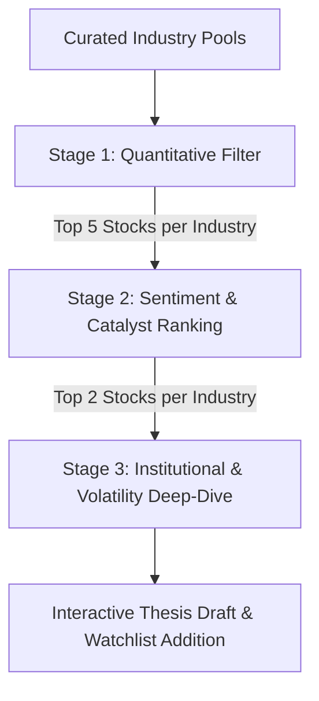

# Plan: AI-Powered Multi-Stage Stock Screener with Gemini

This plan outlines the architecture, design, and step-by-step implementation for a new **AI-Powered Multi-Stage Stock Screener** page (`pages/12_screener.py`) and its backend coordinator (`data/screener_agent.py`). 

The screener is designed to scan curated industry lists, pre-filter them using Python quantitative code, score them using Gemini 3.5 Flash for news/social sentiment, and perform institutional/options deep-dives using Gemini 3.1 Pro on the top candidates. This workflow maximizes alpha generation while staying within Gemini rate limits.

---

## 🎯 Strategic Objective: Finding the "Next Big Stock"
To identify high-conviction opportunities in leading industries, the screener implements a **three-stage intelligence funnel** that mimics professional fund-manager screening:



### Curated Industry Pools (2026 Core Universe)
Rather than wasting API calls and token limits scanning thousands of small-cap noise stocks, the system is seeded with a highly liquid, high-growth sector universe. The user can also add custom tickers.

1. **Semiconductors & AI Hardware (Infrastructure)**
   * *Tickers:* `NVDA`, `AMD`, `AVGO`, `MU`, `TSM`, `ASML`, `AMAT`, `FORM`
   * *Focus:* Custom silicon, high-bandwidth memory (HBM), advanced foundry node pricing.
2. **Cloud Computing & SaaS (Platforms)**
   * *Tickers:* `MSFT`, `AMZN`, `GOOGL`, `PLTR`, `DDOG`, `NET`, `ZS`, `CRM`
   * *Focus:* Cloud hyperscaler revenue growth, AI-native SaaS adoption, cyber-security demand.
3. **Biotechnology & Digital Health (Precision Medicine)**
   * *Tickers:* `TEM`, `RXRX`, `UTHR`, `BNTX`, `LEGN`, `VRTX`, `AMGN`, `MRNA`
   * *Focus:* AI-driven drug discovery pipelines, M&A potential, clinical trial catalysts.
4. **Fintech & Digital Finance (Ecosystems)**
   * *Tickers:* `SQ`, `PYPL`, `SOFI`, `HOOD`, `NU`, `AFRM`, `V`, `MA`
   * *Focus:* Transaction volume growth, AI-underwritten credit, user growth in emerging markets.

---

## 🏗️ Technical Architecture

### 1. File Structure
We will add two new files and register the page:
* `stock-dashboard/data/screener_agent.py` — Handles data aggregation (Yahoo Finance, SEC 13F, Reddit/Twitter, Options chain) and formatting prompt packets for the `agy` CLI client.
* `stock-dashboard/pages/12_screener.py` — Streamlit page for UI rendering, caching status, and interactive controls.
* `stock-dashboard/dashboard.py` — Register the new page inside `_PAGES` (nav bar).

### 2. The 3-Stage Screening Funnel

#### **Stage 1: Python Quantitative Filtering (Zero LLM cost)**
Runs pure Python calculations using [calculator.py](file:///C:/Users/ethan/Downloads/Stock-Dashboard/stock-dashboard/data/calculator.py):
* **Valuation Score**: PE ratio, EV/EBITDA, P/FCF, PEG ratio.
* **Growth Score**: Revenue YoY, EPS YoY, FCF YoY.
* **Profitability Score**: Gross Margin, Net Margin, ROIC.
* **Financial Health**: Net Debt/EBITDA, Current Ratio.
* **Output**: The top 5 stocks in the chosen industry (sorted by an aggregate quantitative rank score).

#### **Stage 2: Catalyst & Sentiment Ranking (Gemini 3.5 Flash)**
For the top 5 stocks, the system fetches:
* Latest news headlines + news sentiment scores from [news_fetcher.py](file:///C:/Users/ethan/Downloads/Stock-Dashboard/stock-dashboard/data/news_fetcher.py) / [news_analyzer.py](file:///C:/Users/ethan/Downloads/Stock-Dashboard/stock-dashboard/data/news_analyzer.py).
* Social sentiment metrics from Reddit/Twitter sentiment tables ([wsb_sentiment.py](file:///C:/Users/ethan/Downloads/Stock-Dashboard/stock-dashboard/data/wsb_sentiment.py)).
* **Gemini Prompt**: Flash is fed a JSON structured payload containing the news highlights and sentiment curves. It is instructed to rank the top 2 candidates based on **near-term catalyst velocity** (e.g., product launches, earnings momentum) and **hype alignment** (underestimated by Wall Street vs. over-hyped).
* **Model**: `Gemini 3.5 Flash (Medium)` (speed, cost-efficiency, large context window).

#### **Stage 3: Deep-Dive Volatility & Smart Money Audit (Gemini 3.1 Pro)**
For the final 2 candidates in the industry, the system collects:
* **Option Chain Microstructure**: Max Pain price, Risk Reversal skew (25-delta skew), and dealer Gamma Exposure (GEX) profiles from [options_agent.py](file:///C:/Users/ethan/Downloads/Stock-Dashboard/stock-dashboard/data/options_agent.py).
* **Institutional Ownership**: Concentrated hedge fund positions, change in position sizing, and put/equity flags from [hedge_fund_fetcher.py](file:///C:/Users/ethan/Downloads/Stock-Dashboard/stock-dashboard/data/hedge_fund_fetcher.py) (13F filings).
* **Gemini Prompt**: Pro receives this quantitative microstructure context and evaluates:
  1. *Dealer Positioning*: Is the stock in a gamma squeeze setup or capped by options dealer hedging?
  2. *Smart Money Divergence*: Are top-tier concentrated hedge funds backing the stock despite retail pessimism?
  3. *Risk/Reward profile*: Suggested entry/alert price based on option volatility boundaries.
* **Model**: `Gemini 3.1 Pro (High)` (advanced multi-step logic and structured output synthesis).

---

## 🎨 User Interface Mockup (`pages/12_screener.py`)

A premium, glassmorphic dark-mode dashboard is proposed:

1. **Dashboard Controls (Sidebar)**:
   * **Industry Selector**: Radio buttons or clickable tabs for *Semiconductors, Cloud, Biotech, Fintech*.
   * **Focus Priority**: A slider adjusting the weights for the screening score (e.g., `Fundamentals Weight` vs. `Social Hype Weight` vs. `Options Flow Weight`).
   * **Run Screen Button**: Primary action button to trigger the analysis pipeline.

2. **Main Interface Tabs**:
   * **📊 Overview & Quantitative Leaderboard**:
     * Shows a table of the selected industry universe with color-coded badges for metrics (`good`, `neutral`, `warn` using yfinance data).
     * Highlights the Stage 1 Python-screened winners.
   * **🤖 Gemini Catalyst Insight**:
     * Displays a dynamic card for each of the top 2 stocks selected in Stage 2.
     * Includes a bulleted list of "Key Catalysts", "Hype Score (1-10)", and "Risk Profile".
     * Interactive expander showing the raw prompt context.
   * **🏦 Institutional & Volatility Deep-Dive**:
     * Displays the Gemini Pro analysis of hedge fund backing and option greeks.
     * Compares the final 2 candidates head-to-head on structural metrics (dealer positioning, risk reversal).
     * Action Buttons:
       * **`📝 Draft Investment Thesis`**: Auto-populates the [thesis.db](file:///C:/Users/ethan/Downloads/Stock-Dashboard/stock-dashboard/db/schema.sql) table with a draft written by Gemini, opening the page to the Thesis Tracker.
       * **`👁️ Add to Watchlist`**: Inserts the ticker into `watchlist.db` with a suggested alert price.

---

## 🛠️ Step-by-Step Implementation Plan

### Step 1: Create `data/screener_agent.py`
Create the backend agent file that orchestrates the data gathering. It will export a function:
```python
def screen_industry(industry_name: str, weights: dict) -> dict:
    # 1. Fetch data for all tickers in industry_name
    # 2. Compute quantitative rankings
    # 3. Aggregates news/social sentiment and calls Gemini Flash to rank top 2
    # 4. Aggregates options/13F data and calls Gemini Pro for deep-dive analysis
    # 5. Returns a structured JSON dictionary of results
```

### Step 2: Create `pages/12_screener.py`
Implement the Streamlit interface using the project's standard structure:
```python
import streamlit as st
from components.gemini_usage_bar import render_gemini_usage_bar
from components.ui import inject_global_css, render_sidebar_nav
# ...
st.set_page_config(page_title="AI Stock Screener", layout="wide")
render_gemini_usage_bar()
inject_global_css()
render_sidebar_nav()
# ...
```
Leverage SQLite caching (`cache.db`) so that if a user runs a screen on the same industry within a 24-hour period, it displays cached results immediately rather than exhausting Gemini usage limits.

### Step 3: Register the Page in `dashboard.py`
Add `{"icon": "🔍", "label": "AI Screener", "path": "pages/12_screener.py"}` to the global navigation list `_PAGES`.

### Step 4: Implement Database Insertion Handlers
Ensure the "Draft Investment Thesis" and "Add to Watchlist" buttons correctly insert records into [thesis.db](file:///C:/Users/ethan/Downloads/Stock-Dashboard/stock-dashboard/db/schema.sql) using existing database helpers without writing raw SQL.

---

## 🔒 Gemini Usage Efficiency and Safety
* **No Inline Mathematics**: Gemini is never asked to calculate growth rates or financial ratios. All mathematical metrics are calculated using Python's `calculator.py` and passed as clear text in the prompt.
* **Token Caching & Rate Limiting**: The screener enforces local SQLite caching. If the industry data has been analyzed in the last 24 hours, the dashboard returns the cached report.
* **Failure Resiliency**: If options data or 13F filing data is missing for a specific ticker, `screener_agent.py` will handle the exception gracefully, omit the missing data, and instruct Gemini to perform the analysis with a warning banner.
